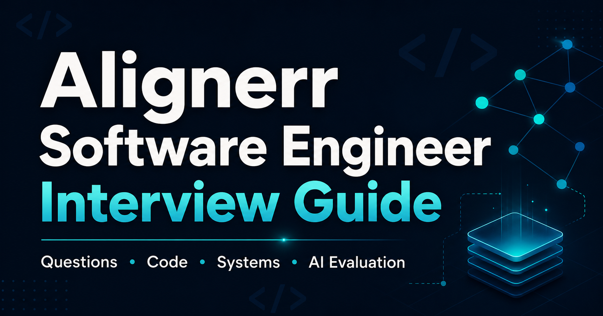

# Alignerr Software Engineer Interview Guide

A free, book-style preparation guide for the Alignerr Software Engineer / AI Training role.

The guide includes:

- Resume and project deep-dive questions
- C++ and Python fundamentals
- Stack memory, dynamic/heap memory, and the heap data structure
- Algorithms and coding exercises with reference solutions
- AI-generated code evaluation and debugging exercises
- Test design and system-design questions
- A concise Zara interview simulation

## Read the book

[Open the published book](https://buicongnguyen.github.io/alignerr-software-engineer-guide/)

The reader is a dependency-free static site with chapter navigation, full-question search, dark-mode support, responsive mobile navigation, reading progress, and print-friendly formatting.



## Source formats

- [`index.html`](index.html) is the book reader deployed to GitHub Pages.
- [`alignerr_software_engineer_interview_guide.md`](alignerr_software_engineer_interview_guide.md) is the editable Markdown source.
- [`alignerr_software_engineer_interview_guide.html`](alignerr_software_engineer_interview_guide.html) is the original standalone HTML export.

## Scope

The questions are representative preparation material inferred from public role descriptions and candidate reports. They are not leaked or guaranteed Alignerr assessment questions.

## Local preview

Serve the repository with any static HTTP server and open `index.html`. For example:

```bash
python -m http.server 8000
```

Then visit `http://127.0.0.1:8000/`.

## Deployment

Every push to `main` publishes the static book through GitHub Actions and GitHub Pages.
